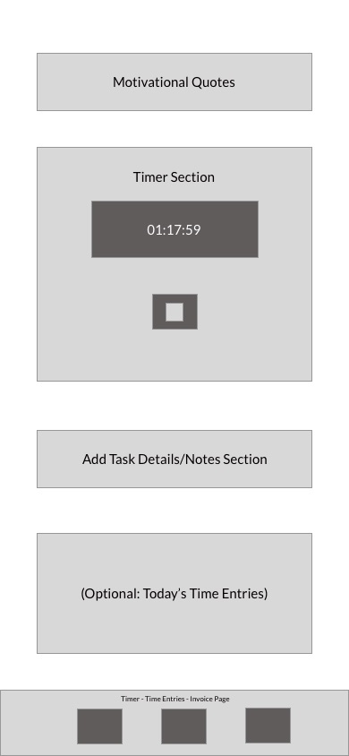

# ProjectPacer

## Overview

**ProjectPacer** is a web-based application crafted specifically for freelancers, aiming to enhance their productivity by providing a way to track time spent on various projects and tasks. The app integrates a timer with start, pause, and stop functionalities, invoicing based on tracked hours, and a motivational quotes feature to inspire users throughout their workday. Additionally, ProjectPacer allows users to add detailed comments to their time entries, ensuring a comprehensive understanding of tasks completed during each tracked period.


### Problem

Managing multiple projects and tasks can often lead to inefficiencies and inaccuracies in time tracking for freelancers, affecting overall productivity. The administrative burden of creating invoices and tracking their status further complicates the workflow. ProjectPacer addresses these challenges by offering a solution that not only simplifies time tracking and invoice management but also boosts motivation through curated inspirational quotes.

### User Profile

ProjectPacer is designed for individual freelancers who need an efficient tool for managing their time, generating invoices, and seeking motivation. This initial version focuses on single-user functionality, with plans to expand features to support teams or agencies in future updates.

### Features

- **Time Tracking with Comments:** Enables time tracking for tasks with the ability to add comments detailing work completed.

- **Time Entries Management:** Offers functionalities to view, edit, and select time entries for invoicing, including detailed comments.

- **Invoice Generation and Management:** Facilitates the creation of invoices from selected time entries, customization of invoice details, tracking of invoice statuses (draft, sent, paid, late), and the ability to export as PDF.

- **Motivational Quotes:** Displays real-time motivational quotes from a third-party API to inspire and support users during their work.

- **Data Export:** Allows users to export time tracking and invoice data for record-keeping and analysis.

## Implementation

### Tech Stack

- **Frontend:** React.js, SASS, and React Router.
- **Backend:** Node.js, Express for server-side logic, (For future development: database for data storage).
- **Libraries:** jsPDF for PDF generation, axios for API requests, (maybe also Redux for easier state management).

### APIs

- ZenQuotes.io - https://zenquotes.io/

### Sitemap

- **Timer Page:** Central hub for time tracking, viewing quotes, and adding comments to tasks.
- **Time Entries Page:** Allows management and review of all time entries and can select specific time entries to create invoice.
- **Invoices Page:** Handles the creation, review, and status management of invoices. You can click to download PDF file. 

### Mockups




### Data

- **Time Entries:** Enhanced to include start/end times, duration, task-specific comments, and invoicing status.
- **Invoices:** Detailed with invoice ID, associated time entries, total amount, status, and relevant dates.

### Endpoints

#### **1. Clients**

- **GET `/clients`**: Get all clients.
- **POST `/clients`**: Add a new client.
- **GET `/clients/:id`**: Get client by ID.
- **PATCH `/clients/:id`**: Edit client by ID.
- **DELETE `/clients/:id`**: Delete client by ID.
- **GET `/clients/:id/invoices`**: Get all invoices related to client with ID.

```jsx
{
        clientid: 1,
        name: 'Alice Johnson',
        email: 'alice@example.com',
        address: '1234 Main St',
        phone: '604-441-1001',
    }
```

#### **2. Timers**

- **GET `/timers`**: Get all timers.
- **POST `/timers`**: Start a new timer.
- **GET `/timers/:id`**: Get timer details.
- **PATCH `/timers/:id`**: Edit timer details.
- **DELETE `/timers/:id`**: Delete timer.

```jsx
{
    timerid: 4,
    starttime: '2024-02-04 10:15:00',
    endtime: '2024-02-04 12:45:00',
    duration: 9000,
    description: 'Client review meeting for Project D',
    projectid: 4,
  }
```

#### **3. Entries**

- **GET `/entries`**: Get all time entries.
- **POST `/entries`**: Add new time entry.
- **GET `/entries/:id`**: Get details of entry by ID.
- **PATCH `/entries/:id`**: Edit entry by ID.
- **DELETE `/entries/:id`**: Delete entry by ID
- **GET `/entries/by-timer/:timerid`**: Get entries by timer id. (might remove - not sure if logic works yet)

```jsx
{
      entryid: 8,
      timerid: 8,
      date: '2024-02-08',
      hours: 2.25,
      description: 'Project B: Frontend styling and responsive design adjustments',
    }
```

#### **4. Invoices**

- **GET `/invoices`**: Get all invoices.
- **POST `/invoices`**: Add new invoice.
- **GET `/invoices/:id`**: Get invoice by ID.
- **PATCH `/invoices/:id`**: Edit invoice by ID.
- **DELETE `/invoices/:id`**: Delete invoice by ID.

### Auth

ProjectPacer will initially support a single user without authentication, with plans to introduce authentication mechanisms in future versions for expanded user functionalities.

## Roadmap

- Create client
    - React project with routes and boilerplate pages
- Create server
    - Express project with routing
- Feature: Time Tracker (basic requirements: start & pause )
- Feature: Time entries page & post time entries (backend data storage - now with json file)
- Feature: Time Tracker with Comments (ability to add comments to time entry)
- Feature: Deleting capability 
- ZenQuotes API Connection
- Front-End Design of Time Tracker 
- Feature: Invoicing  
- Front-End Design of Invoicing
- Feature: PDF Exporting
- Bug Fixes
- Demo Day

## Nice-to-haves
- **Database Utilization:** For comprehensive data management.
- **Edit Time Entries, Notes, Invoices Functionality:** To enhance the UX of the app but only if I have extra time to set this up. 
- **Multi-User Support:** Future versions will include functionalities for team or multiple user environments.